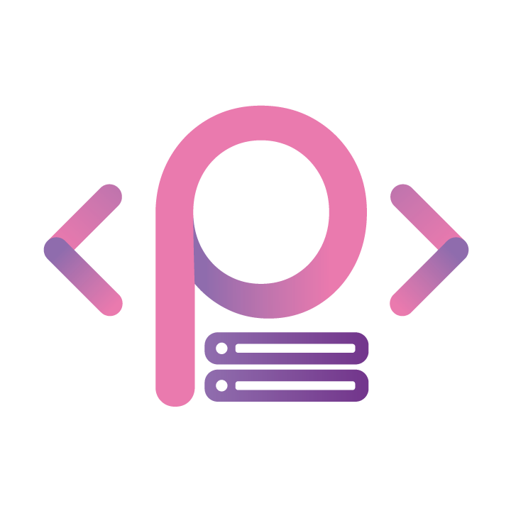

<!-- Heading Image -->

  

<!-- Welcome Section -->

<h1 align="center">
  
    𝙒𝙚𝙡𝙘𝙤𝙢𝙚 𝙩𝙤 𝙢𝙮 𝙂𝙞𝙩𝙃𝙪𝙗 𝙋𝙧𝙤𝙛𝙞𝙡𝙚
  
</h1>

<b><em>Make sure to checkout my <a href="https://gitlab.com/JordanPicton" target="_blank">GitLab</a> and <a href="https://codeberg.org/JordanPicton" target="_blank">Codeberg</a> accounts as these are more up to date than GitHub.</em></b>

<!-- About Me  Font used = Maths Sans Italic Bold-->

## 🗒️ 𝗔𝗯𝗼𝘂𝘁 𝗠𝗲:
𝙃𝙚𝙮, 𝙄'𝙢 𝙅𝙤𝙧𝙙𝙖𝙣 𝙖𝙣 𝙖𝙨𝙥𝙞𝙧𝙞𝙣𝙜 𝙒𝙚𝙗 𝙖𝙣𝙙 𝙎𝙤𝙛𝙩𝙬𝙖𝙧𝙚 𝘿𝙚𝙫𝙚𝙡𝙤𝙥𝙢𝙚𝙣𝙩 𝙨𝙩𝙪𝙙𝙚𝙣𝙩, 𝙄'𝙢 𝙘𝙪𝙧𝙧𝙚𝙣𝙩𝙡𝙮 𝙡𝙚𝙖𝙧𝙣𝙞𝙣𝙜 <a href="https://www.udemy.com/course/the-web-developer-bootcamp/?couponCode=ST14MT32124">𝙒𝙚𝙗 𝘿𝙚𝙫𝙚𝙡𝙤𝙥𝙢𝙚𝙣𝙩</a> 𝙫𝙞𝙖 𝙖 <a href="https://www.udemy.com">𝙐𝙙𝙚𝙢𝙮</a> 𝙘𝙤𝙪𝙧𝙨𝙚 𝙛𝙧𝙤𝙢 <a href="https://www.udemy.com/user/coltsteele/">𝘾𝙤𝙡𝙩 𝙎𝙩𝙚𝙚𝙡𝙚</a>, 𝙬𝙝𝙞𝙡𝙨𝙩 𝙖𝙡𝙨𝙤 𝙨𝙚𝙡𝙛-𝙡𝙚𝙖𝙧𝙣𝙞𝙣𝙜, 𝙇𝙞𝙣𝙪𝙭, 𝙎𝙮𝙨𝙖𝙙𝙢𝙞𝙣, 𝙉𝙂𝙄𝙉𝙓, 𝙃𝙤𝙢𝙚𝙡𝙖𝙗𝙨 𝙖𝙣𝙙 𝙉𝙚𝙩𝙬𝙤𝙧𝙠𝙞𝙣𝙜.

### :office: Employment:
𝙊𝙥𝙚𝙣 𝙩𝙤 𝙬𝙤𝙧𝙠 𝙖𝙣𝙙 𝙛𝙧𝙚𝙚𝙡𝙖𝙣𝙘𝙞𝙣𝙜.

𝙁𝙄𝘽𝙍𝙊-𝘾𝙊𝙉𝙉𝙀𝘾𝙏 𝙏𝙎 - 𝙒𝙚𝙗 𝙈𝙖𝙞𝙣𝙩𝙖𝙞𝙣𝙚𝙧 / 𝘼𝙙𝙢𝙞𝙣𝙞𝙨𝙩𝙧𝙖𝙩𝙤𝙧 - 𝟮𝟬𝟮𝟱 - 𝙊𝙣𝙜𝙤𝙞𝙣𝙜 (𝙋𝙖𝙧𝙩 𝙏𝙞𝙢𝙚)
### :mortar_board: Education:
𝙐𝙣𝙞𝙫𝙚𝙧𝙨𝙞𝙩𝙮: 𝙏𝙝𝙚 𝙊𝙥𝙚𝙣 𝙐𝙣𝙞𝙫𝙚𝙧𝙨𝙞𝙩𝙮 𝟮𝟬𝟮𝟱 - 𝙀𝙭𝙥𝙚𝙘𝙩𝙚𝙙 𝟮𝟬𝟮𝟵 - 𝙎𝙤𝙛𝙩𝙬𝙖𝙧𝙚 𝘿𝙚𝙫𝙚𝙡𝙤𝙥𝙢𝙚𝙣𝙩

𝘾𝙤𝙡𝙡𝙚𝙜𝙚: 𝙃𝙋𝙇 𝘾𝙤𝙡𝙡𝙚𝙜𝙚 𝙤𝙛 𝙁𝙀 𝟮𝟬𝟮𝟱 - 𝙀𝙭𝙥𝙚𝙘𝙩𝙚𝙙 𝟮𝟬𝟮𝟲 - 𝘾𝙮𝙗𝙚𝙧 𝙎𝙚𝙘𝙪𝙧𝙞𝙩𝙮

## :computer: Skills:
𝘽𝙚𝙡𝙤𝙬 𝙞𝙨 𝙨𝙤𝙢𝙚 𝙤𝙛 𝙩𝙝𝙚 𝙩𝙤𝙤𝙡𝙨 𝙄 𝙠𝙣𝙤𝙬 𝙝𝙤𝙬 𝙩𝙤 𝙪𝙨𝙚, 𝙖𝙡𝙤𝙣𝙜 𝙬𝙞𝙩𝙝 𝙩𝙝𝙚 𝙡𝙖𝙣𝙜𝙪𝙖𝙜𝙚𝙨 𝙄 𝙘𝙖𝙣 𝙪𝙨𝙚 𝙩𝙤 𝙖 𝙘𝙚𝙧𝙩𝙖𝙞𝙣 𝙚𝙭𝙩𝙚𝙣𝙩.

### :hammer_and_wrench: Tools:
  
  
  
  

### 👨‍💻 Technologies:
<table>
  <tr>
    <td>
       
    </td>
    <td>
      
    </td>
    <td>
      
    </td>
    <td>
      
    </td>
    <td>
      
    </td>
  </tr>
  <tr>
    <td>
      
    </td>
    <td>
      
    </td>
    <td>
      
    </td>
    <td>
      
    </td>
    <td>
      
    </td>
  </tr>
  <tr>
    <td>
      
    </td>
    <td>
      
    </td>
    <td>
      
    </td>
    <td>
      
    </td>
    <td>
      
    </td>
  </tr>
  <tr>
    <td>
      
    </td>
    <td>
      
    </td>
    <td>
      
    </td>
    <td>
      
    </td>
    <td>
      
    </td>
  </tr>
</table>

### :link: Personal Links:
  
  
    
  
  
  

  
  ### :link: Pictostudio Links:
  
  
  
  
  

#### Credits:
  - <a href="https://lingojam.com/FancyTextGenerator">lingojam</a> for the text generator.